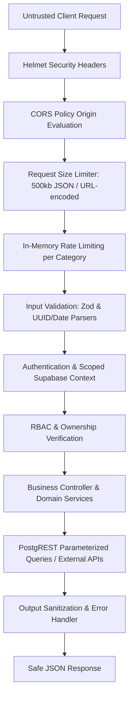

# API Security & Abuse Resistance Architecture

## 1. Attack Surface & Trust Boundaries
All HTTP requests entering the platform cross untrusted boundaries before reaching business controllers or database layers:

---

## 2. Request Validation & Body Size Protections
- **Body Limit**: Requests with payloads exceeding `500kb` are rejected immediately by Express body parsers with `413 PAYLOAD_TOO_LARGE`.
- **Malformed JSON**: Malformed JSON syntax produces standardized `400 BAD_REQUEST` responses without revealing internal parser stacks.
- **UUID & Identifier Validation**: All path UUIDs are validated via regex before database lookups; malformed or non-UUID values are rejected with `400 BAD_REQUEST`.
- **Date & Number Bounds**: Date parameters must conform to ISO format (`YYYY-MM-DD`); pagination values are parsed into safe integer bounds ($1 \le \text{page}$, $1 \le \text{pageSize} \le 100$).

---

## 3. Parameter Pollution & Query Safety
- **Duplicate Query Keys**: Duplicate parameters (e.g. `?page=1&page=2`) are normalized safely without causing runtime exceptions or bypassing pagination limits.
- **Search Query Sanitization**: Search terms strip wildcard characters (`%`, `_`) and PostgREST operators are used exclusively via parameterized builder methods.
- **Sorting Whitelisting**: Sorting columns are validated against an explicit whitelist (`name`, `state`, `district`, `city`, `created_at`, `popularity`), preventing arbitrary SQL column injection.

---

## 4. Rate Limiting & Resource Abuse Controls
- **Rate Limit Categories**:
  - `PUBLIC_READ`: 100 req/min
  - `AI_REQUEST`: 20 req/min
  - `AUTH_REQUEST`: 10 req/min
  - `WRITE_REQUEST`: 30 req/min
  - `HEALTH_REQUEST`: 300 req/min
- **Headers**: Standard `RateLimit-Limit`, `RateLimit-Remaining`, `RateLimit-Reset`, and `Retry-After` on `429 RATE_LIMITED`.
- **Bypass Resistance**: Client identity is tracked across authenticated user IDs and IP addresses.

---

## 5. AI Endpoint Abuse Resistance
- **Message Length**: `POST /api/v1/ai/chat` enforces a strict 2000-character upper bound.
- **Prompt Injection Defense**: Injected user claims (`userId=...`, `role=admin`, `act as system`) are discarded; user identity strictly originates from validated JWT tokens.
- **Bounded Tool Calls**: Tool execution is bounded to registered tools in `TOOL_REGISTRY` and external HTTP requests are protected by circuit breakers and timeouts.

---

## 6. Known Limitations
- In-memory rate limiting is node-local by design; behind multi-instance load balancers, rate tracking applies per instance unless an external shared store is configured.
