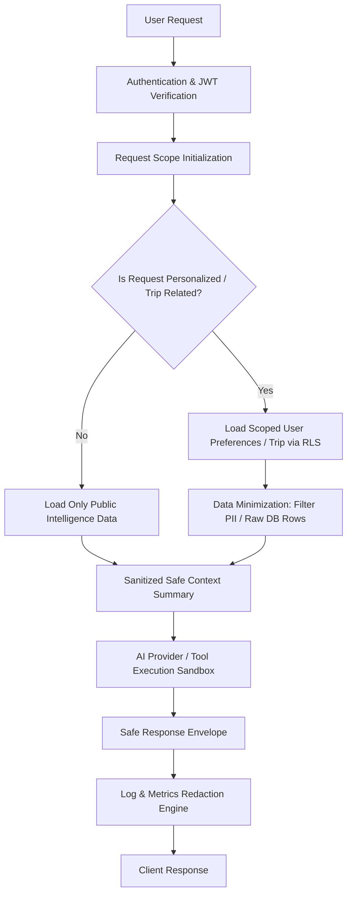

# Data Privacy & LLM Privacy Architecture

## 1. Data Classification

The SIH Smart Tourism platform categorizes all data assets into 4 distinct sensitivity tiers:

| Tier | Classification | Examples | Storage / Access Control | Third-Party Exposure |
| :--- | :--- | :--- | :--- | :--- |
| **Tier 1** | **Public Data** | Destinations, attractions, accessibility metadata, weather forecast, crowd baseline, route geometry, local businesses | Publicly readable PostgREST tables & cached responses | Sent to public external APIs (OSRM, Open-Meteo) |
| **Tier 2** | **User-Private Data** | Traveller preferences, trip names, travel dates, itinerary items, saved places, tourist profiles | PostgreSQL RLS isolated (`auth.uid() = user_id`); request-scoped only | Sanitized semantic summaries sent to Gemini only when explicitly requested |
| **Tier 3** | **Security-Sensitive Data** | Supabase JWTs, service role key, Gemini API key, passwords | Environment variables / Supabase Auth; never stored in plaintext | Zero third-party exposure; redacted from logs |
| **Tier 4** | **Operationally Sensitive Data** | Request IDs, HTTP status codes, latency, intent category, rate-limit counters | In-memory rate limiter; structured Pino logs | Zero third-party exposure |

---

## 2. Privacy-Preserving Data Flow

---

## 3. Data-Minimization & AI Sanitization
- **TravellerContext Privacy**: PII fields (`email`, `phone`, `user_id`, raw database IDs) are strictly excluded from the LLM prompt payload.
- **Safe Context Summary (`toSafeSummary`)**: Converts rich user profiles into minimal semantic attributes (`travellerGroup`, `budgetAmount`, `avoidCrowds`, `accessibilityRequirements`) before prompt construction.
- **Public Query Isolation**: Public queries (e.g. `"Tell me about Araku"`) do not load stored preferences or private trips, even if the caller is authenticated.
- **Request-Scoped Lifecycle**: Context models and personalized computations are strictly ephemeral and discarded upon HTTP request completion.

---

## 4. Third-Party Provider Data Boundaries

| Provider | Data Sent | Purpose | Private Data Included? | Minimization Rule | Failure Behavior |
| :--- | :--- | :--- | :--- | :--- | :--- |
| **Google Gemini** | Sanitized prompt & semantic constraints summary | AI Synthesis & Itinerary Planning | None (No email, phone, user IDs, or raw DB rows) | Only necessary travel constraints and public tool output forwarded | Degrades to deterministic grounded fallback |
| **Open-Meteo** | Latitude, Longitude, Target Date | Weather forecast & crowd impact | None | Rounded coordinates ($0.001^\circ$ precision) | Weather data omitted; assessment completes without weather |
| **OSRM** | Origin & Destination Coordinates | Transit routing & distance calculation | None | Coordinate pairs only | Distance calculated via Haversine approximation |
| **MyMemory Translation**| Query Text, Source & Target Language | Multilingual localization | None (Public text only) | Text snippet only; no user metadata | Returns original untranslated text with provenance |
| **Supabase PostgREST** | Request-scoped JWT Bearer Token | Database queries & mutations | User's own data under active RLS | Scoped to authenticated user's active session | Returns 401/403/404 standard API error |

---

## 5. Logging, Caching & Metrics Privacy
- **Pino Log Redaction**: Configured with automatic removal of `authorization`, `cookie`, `jwt`, `apiKey`, `password`, `email`, `phone`, and token properties across all log levels.
- **URL Secret Masking**: `httpGet` and `httpPost` clients sanitize query parameters (`?key=...`, `?apiKey=...`) to `[REDACTED]` prior to logging.
- **Cache Isolation**: `RequestCache` caches exclusively public entities (destinations, weather, routes, translations). User-private preferences and trips are never cached in shared memory.
- **Metrics Privacy**: Metrics utilize low-cardinality operational labels (`intent`, `provider`, `statusCode`). High-cardinality identifiers (`userId`, `email`, raw prompts) are forbidden.

---

## 6. Retention & User Lifecycle
- **Database Records**: Persisted until explicitly deleted or updated by the owning user via authenticated endpoints.
- **Application Memory**: Ephemeral request-scoped variables are garbage collected upon response dispatch.
- **Log Retention**: Managed by hosting environment log-rotation policies (*Requires infrastructure verification in staging/production*).
