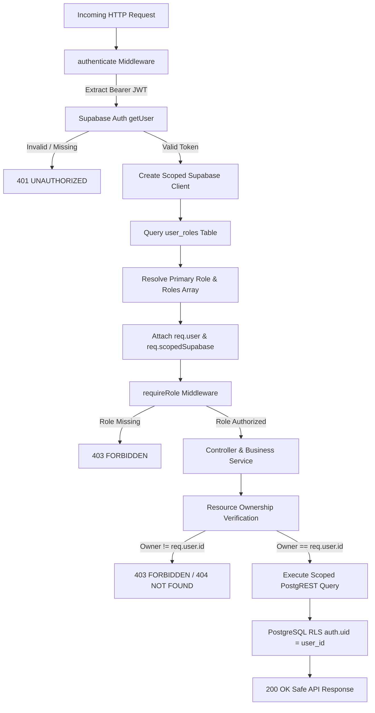

# Role-Based Access Control (RBAC) & Authorization Architecture

## 1. Supported Roles
The Smart Tourism platform supports three primary application roles:
- **`tourist`**: Travelers creating and managing their own trips, bookmarks, travel preferences, and receiving personalized AI tourism guidance.
- **`business`**: Local tourism operators, accommodation providers, and verified vendors managing local business assets.
- **`admin`**: System administrators managing catalog verifications, system health, and system-level operations.

---

## 2. Role Hierarchy & Multi-Role Precedence
When a user possesses multiple assigned roles in `user_roles`, the primary role is deterministically computed using the precedence:
$$\text{admin} > \text{business} > \text{tourist}$$

Users retain all assigned roles in the `roles` array (`roles: AppRole[]`). Authorization checks via `requireRole(...allowedRoles)` check both individual assigned roles and the primary role.

---

## 3. Authorization Flow Diagram

---

## 4. Role Source Precedence
1. **Validated Authenticated Identity**: Token is verified by Supabase Auth (`supabase.auth.getUser(token)`).
2. **Database Role Records**: Queried from the `user_roles` table using the user's scoped client.
3. **Metadata Fallback**: If no database roles exist, verified `app_metadata.role` or `user_metadata.role` is inspected for initial bootstrap.
4. **Untrusted Client Inputs**: Any `body.role`, `query.role`, `headers.role`, or `path.role` is completely ignored by the server.

---

## 5. Resource Ownership Model
All user-specific resources are strictly bounded to the authenticated user ID (`req.user.id`):
- **Trips & Itineraries**: `TripService.ensureTripOwnership` validates `trip.user_id === req.user.id` before reading, updating, or deleting trips and items.
- **Saved Places**: Bookmarks are scoped to `req.user.id` and queries strictly filter by `user_id`.
- **Preferences**: Travel preferences and tourist profiles are updated and retrieved exclusively for `req.user.id`.
- **Transparency / Context Preview**: `GET /api/v1/ai/context-preview` exposes only the calling user's own stored preferences.

---

## 6. RLS Defense-in-Depth & Service Role Safety
- **38 PostgreSQL RLS Policies**: Enforce `auth.uid() = user_id` directly in the database engine across all 36 Supabase tables.
- **Zero Service-Role Leaks**: `getAdminClient()` is never used in standard user request handlers or business controllers. Scoped clients forward the user's JWT to preserve PostgreSQL RLS evaluation.
